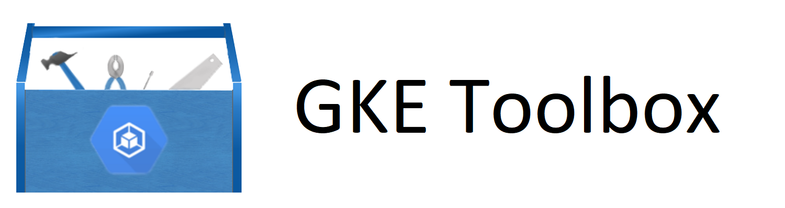

## Introduction

The GKE Toolbox is a Helm chart that installs and configures useful tools into your Container Engine Clusters

## Tools

### Enabled by Default
- [Prometheus](https://prometheus.io/) ([`chart`](https://kubeapps.com/charts/stable/prometheus)) -> Kubernetes native monitoring and alerting of your nodes, pods, services, and controller states
- [Grafana](https://grafana.com/) ([`chart`](https://kubeapps.com/charts/stable/grafana)) -> Flexible Dashboards for Kubernetes 
- [Nginx Ingress](https://github.com/kubernetes/ingress/tree/master/controllers/nginx) ([`chart`](https://kubeapps.com/charts/stable/nginx-ingress)) -> Allows you to use Nginx as an ingress controller which can be more flexible than the Google HTTP(S) load balancer

### Disabled by Default
- [Kube Lego](https://github.com/jetstack/kube-lego) ([`chart`](https://kubeapps.com/charts/stable/kube-lego)) -> Automatically get TLS certificates for your ingresses
- [External DNS](https://github.com/kubernetes-incubator/external-dns) -> Map your service and ingress IPs to DNS records in Cloud DNS
- [Istio](https://istio.io) ([`chart`](https://kubeapps.com/charts/incubator/istio)) -> Kubernetes native service mesh
- [Spinnaker](https://www.spinnaker.io/) ([`chart`](https://kubeapps.com/charts/stable/spinnaker)) -> Continuous Delivery solution for Kubernetes workloads
- [Gitlab](https://gitlab.com) ([`chart`](https://docs.gitlab.com/ee/install/kubernetes/gitlab_chart.html)) -> Source code management and continuous integration/delivery system

## Prerequisites
1. Credentials to a Container Engine cluster with at least 3 cores and 8GB or RAM
1. For external-dns, a cluster with the following scope enabled at creation: `https://www.googleapis.com/auth/ndev.clouddns.readwrite`

## Getting Started

1. Clone this repository

        git clone https://github.com/viglesiasce/gke-toolbox

1. Change directories to the repo

        cd gke-toolbox

1. [Install Helm](https://github.com/kubernetes/helm/blob/master/docs/install.md#installing-the-helm-client)
1. Initialize Helm

        helm init

1. Add repositories that we depend on:

        helm repo add gke-tb.incubator https://kubernetes-charts-incubator.storage.googleapis.com/

1. Download dependent charts

        helm dep build

1. Install this Chart

        helm install -n toolbox .
